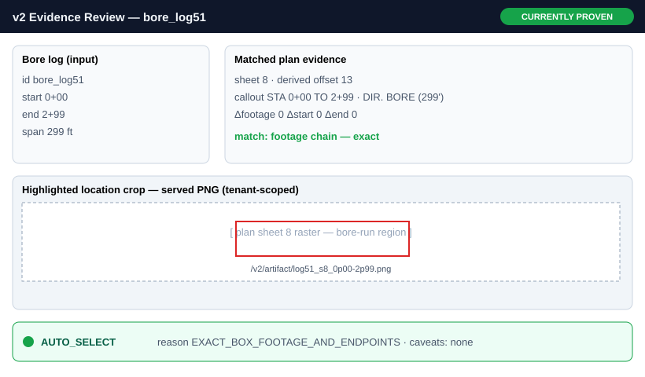
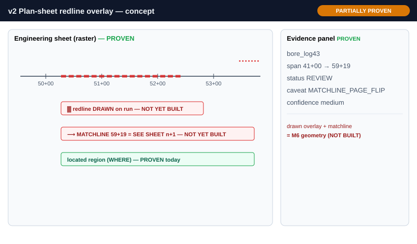
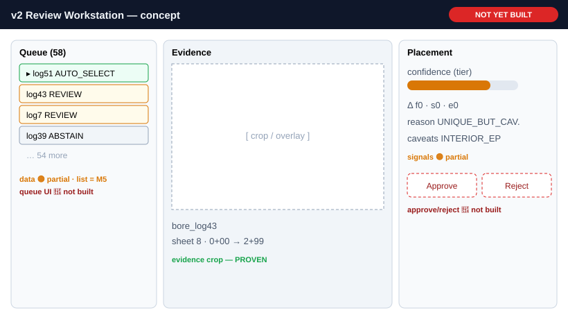
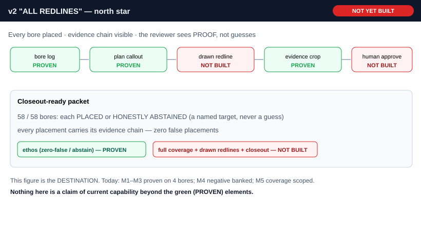

# TrueLine v2 — Redline Workflow Vision (design exploration)

**Status:** DESIGN EXPLORATION — concept only. **No engine code. No production. Docs-only.**
**Date:** 2026-06-09 · **Branch:** `feat/truelinev2` (isolated; not merged to main)

**Purpose:** visualize the *destination* of v2. This document **does not claim current
capability.** Every figure and element is labeled. Read the Reality Ledger first; when a
figure and the ledger seem to disagree, the **ledger is the truth**.

> ⚠️ **Honesty rule — labels are literal:**
> - 🟢 **CURRENTLY PROVEN** — exists and is demonstrated in v2 today (M1–M3, 43 tests).
> - 🟡 **PARTIALLY PROVEN** — the underlying data/capability exists, but the *depicted form* is not built.
> - 🔴 **NOT YET BUILT** — aspirational; no implementation exists.
>
> The wireframes are **presentation concepts**. v2 today exposes its results as a JSON
> Match-Review payload + a served PNG crop over a thin API — **there is no GUI yet.**
> A box in a mockup is not a feature.

---

## Reality ledger (source of truth for every figure)

| Capability | Status | Evidence / note |
|---|---|---|
| Ingest bore log (Brenham flat-table + ODOT VeroFy) → canonical `Bore` | 🟢 PROVEN | M1/M2/M3; `ingest/borelog_*` |
| Open plan PDF, select dialect, calibrate offset | 🟢 PROVEN | M1/M2/M3; `ingest/pdf.py`, `extract/registry.py` |
| Match bore→plan with **honest abstain** (AUTO_SELECT / REVIEW / ABSTAIN) | 🟢 PROVEN | M1 AUTO (Brenham log51); M2/M3 ODOT REVIEW; `match/` |
| Render **evidence crop** (clip of the plan region) + serve over HTTP, tenant-scoped | 🟢 PROVEN | `render/crop.py`; `/v2/artifact/...`; M1 served PNG |
| Per-bore review payload (status / tier / reason / caveats / deltas / artifact) | 🟢 PROVEN | `review/payload.py`; `/v2/review` |
| Evidence-not-guesses ethos (zero-false, abstain over guess) | 🟢 PROVEN | enforced invariant; M4 banked a negative rather than guess |
| Placement-confidence signals (tier, caveats, footage/endpoint deltas) | 🟡 PARTIAL | signals exist as data; not surfaced as a confidence UI |
| Corpus-wide coverage (all 58 Brenham logs) | 🔴 NOT BUILT | **M5 scoped, not run** |
| **Redline drawn ON the plan sheet** (overlay geometry) | 🔴 NOT BUILT | v2 crops/highlights; it does not draw the run (M6) |
| Matchline continuation **drawing** across sheets | 🔴 NOT BUILT | a `MATCHLINE_PAGE_FLIP` caveat exists; the drawing does not |
| Geo (lon/lat) redline geometry on a route map | 🔴 NOT BUILT | v2 ingests **no KMZ**; this is a separate subsystem |
| Operator queue + approve/reject workflow | 🔴 NOT BUILT | no GUI; `web/` untouched and gated |
| "Every bore placed" (ALL REDLINES) + closeout-ready packet | 🔴 NOT BUILT | north-star vision |

---

## Concept 1 — Evidence-only review  🟢 CURRENTLY PROVEN (capability)



```
┌─ v2 Evidence Review — bore_log51 ───────────────────── [AUTO_SELECT] ─┐
│  ┌─ Bore log (input) ───────┐   ┌─ Matched plan evidence ───────────┐ │
│  │ id     bore_log51        │   │ sheet 8   offset 13               │ │
│  │ start  0+00              │   │ callout STA 0+00 TO 2+99          │ │
│  │ end    2+99              │   │         DIR. BORE (299')          │ │
│  │ span   299 ft            │   │ Δfoot 0  Δstart 0  Δend 0         │ │
│  └──────────────────────────┘   └───────────────────────────────────┘ │
│  ┌─ Highlighted location crop (served PNG, tenant-scoped) ───────────┐ │
│  │     [ plan sheet 8 raster — bore-run region boxed ]               │ │
│  │     /v2/artifact/log51_s8_0p00-2p99.png                           │ │
│  └───────────────────────────────────────────────────────────────────┘ │
│  Disposition: ● AUTO_SELECT  reason EXACT_BOX_FOOTAGE_AND_ENDPOINTS    │
└────────────────────────────────────────────────────────────────────────┘
```

- 🟢 **Proven:** bore ingest, match + disposition, the served evidence crop, the payload fields shown.
- 🟡 **Presentation only:** the laid-out card above — today this is JSON + a PNG, not a rendered card.
- 🔴 **Not built:** nothing structural; this concept reflects shipped capability.
- **What it would take to "build" the view:** a thin read-only renderer over the existing payload (UI work, `web/`-gated). No engine change.

---

## Concept 2 — Plan-sheet redline overlay  🟡 PARTIALLY PROVEN



```
┌─ v2 Plan-sheet redline overlay — concept ─────────── [PARTIALLY PROVEN] ─┐
│ ┌─ Engineering sheet (raster) ────────────────┐ ┌─ Evidence panel ─────┐ │
│ │  ──axis── 50+00 ─ 51+00 ─ 52+00 ─ ...        │ │ bore_log43           │ │
│ │  ▓▓▓▓ redline DRAWN on run ▓▓▓▓  ◄ NOT BUILT │ │ span 41+00→59+19     │ │
│ │  ⟶ MATCHLINE 59+19 = SEE SHEET n+1 ◄NOT BUILT│ │ status REVIEW        │ │
│ │  (the located region IS known today)         │ │ caveat MATCHLINE_..  │ │
│ └──────────────────────────────────────────────┘ └──────────────────────┘ │
└──────────────────────────────────────────────────────────────────────────┘
```

- 🟢 **Proven:** rasterizing the engineering sheet; knowing *where* the bore is (located region); the evidence panel data.
- 🔴 **Not yet built:** drawing the actual redline geometry **on** the sheet; matchline continuation drawing across page breaks.
- **What it would take:** the **M6 geometry milestone** — and a design decision: *plan-space overlay* (draw the run on the sheet raster) vs *geo lon/lat parity* (a larger new KMZ subsystem). M5's coverage map informs which, and which logs are safe to draw first.

---

## Concept 3 — Full review workstation  🔴 NOT YET BUILT (backing data 🟡 partial)



```
┌─ v2 Review Workstation — concept ────────────────────── [NOT YET BUILT] ─┐
│ ┌ Queue ─────────┐ ┌ Evidence ─────────────┐ ┌ Placement ─────────────┐ │
│ │ ▸ log51  AUTO  │ │  [ crop / overlay ]    │ │ confidence ████░ (tier)│ │
│ │   log43  REVIEW│ │                        │ │ Δ f0 s0 e0             │ │
│ │   log7   REVIEW│ │  bore_log43            │ │ reason UNIQUE_BUT_CAV. │ │
│ │   log39  ABSTAIN│ │  sheet 8 · 0+00→2+99  │ │ caveats INTERIOR_EP    │ │
│ │   … (58 total) │ │                        │ │ [ Approve ] [ Reject ] │ │
│ └────────────────┘ └────────────────────────┘ └────────────────────────┘ │
└──────────────────────────────────────────────────────────────────────────┘
```

- 🟡 **Partially proven (data):** each bore's review payload, the disposition, and confidence-ish signals (tier / caveats / deltas) already exist per log.
- 🔴 **Not yet built:** the queue GUI; a corpus-wide list (that's **M5**, scoped/not run); the **Approve / Reject** actions (v2 has no operator-decision write-path; `web/` is untouched and gated).
- **What it would take:** M5 (to populate the queue with real corpus results) → an approve/reject persistence path in v2's store/api → a GUI (UI work, `web/`-gated, explicit approval required).

---

## Concept 4 — "ALL REDLINES" vision  🔴 NOT YET BUILT (ethos 🟢 proven)



```
┌─ v2 "ALL REDLINES" — north star ─────────────────────── [NOT YET BUILT] ─┐
│  pipeline:  bore → plan callout → drawn redline → evidence crop → approve │
│  status:    🟢PROVEN   🟢PROVEN     🔴NOT BUILT     🟢PROVEN     🔴NOT BUILT│
│                                                                           │
│  ┌ Closeout-ready packet ──────────────────────────────────────────────┐ │
│  │  58/58 bores: each PLACED or HONESTLY ABSTAINED (a named target)     │ │
│  │  every placement carries its evidence chain — zero guesses           │ │
│  └──────────────────────────────────────────────────────────────────────┘ │
└───────────────────────────────────────────────────────────────────────────┘
```

- 🟢 **Proven (ethos):** evidence-not-guesses — zero-false, honest abstain. The design already refuses to fabricate (M4 banked a negative rather than guess).
- 🔴 **Not yet built:** full corpus coverage ("every bore placed"), drawn redlines, and a closeout-ready workflow.
- **Honest framing:** "ALL REDLINES" is the *standard the engine is being driven toward by extracting missing relationships* — abstention is an interim safety state, not the product. This figure is the destination, not today.

---

## How these map to milestones (sequence, not promises)

| Milestone | Moves which concept forward | State |
|---|---|---|
| **M5** Brenham coverage sweep | Concept 3 queue *data*; reality of Concept 1 at corpus scale | scoped, not run |
| **M6** redline geometry | Concept 2 (overlay vs geo decision) | not started |
| **M7** review workstation UI (`web/`-gated) | Concept 3 GUI + approve/reject | not started |
| **ALL REDLINES** | Concept 4 | north star |

## Closing
Nothing in this document is a claim of current capability beyond the 🟢 rows in the
Reality Ledger. The figures exist to align on the destination — not to imply it is reached.
